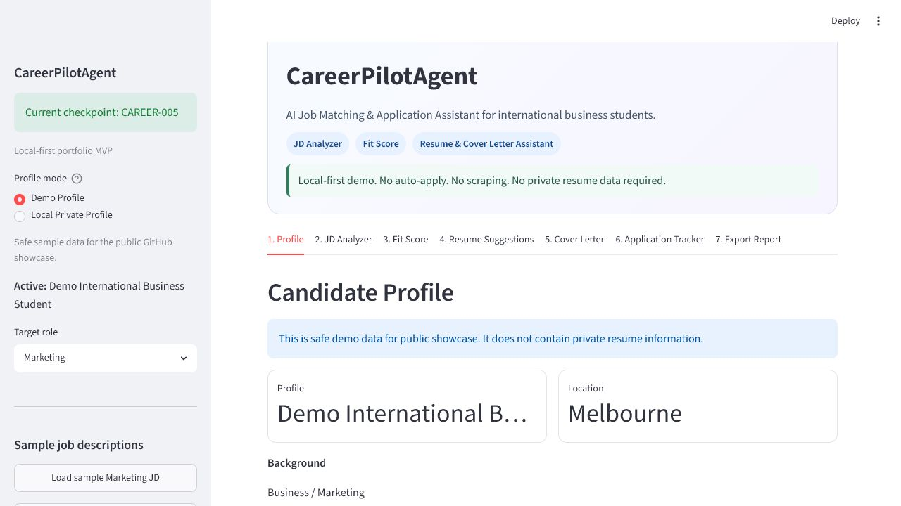
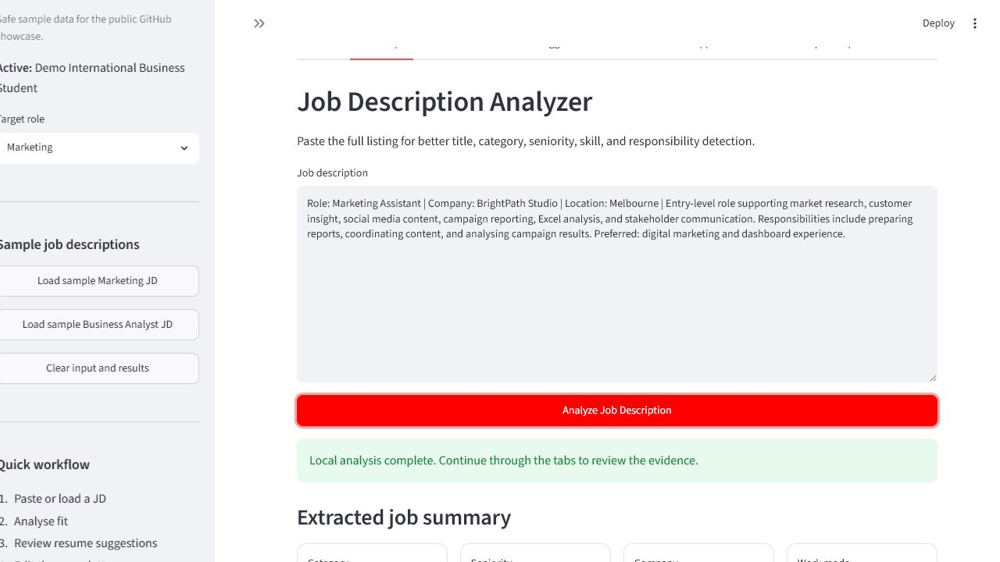
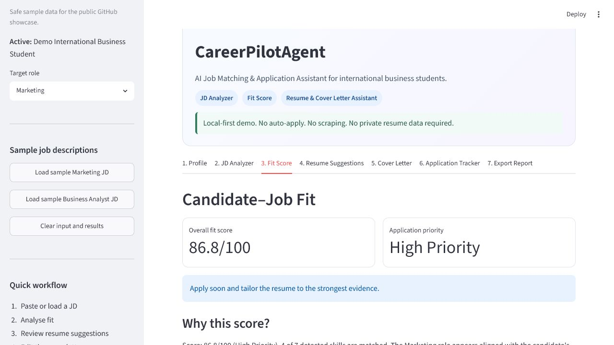
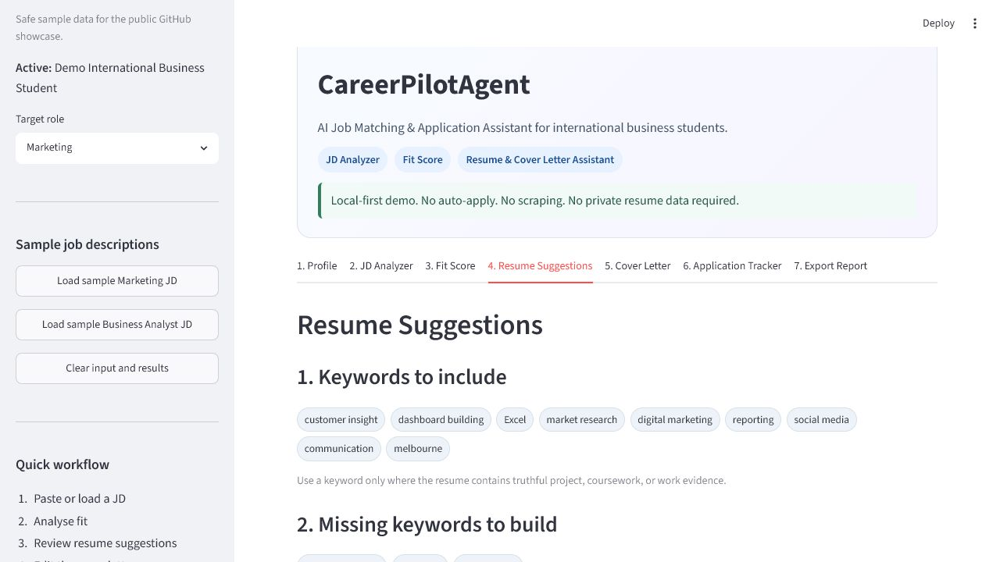
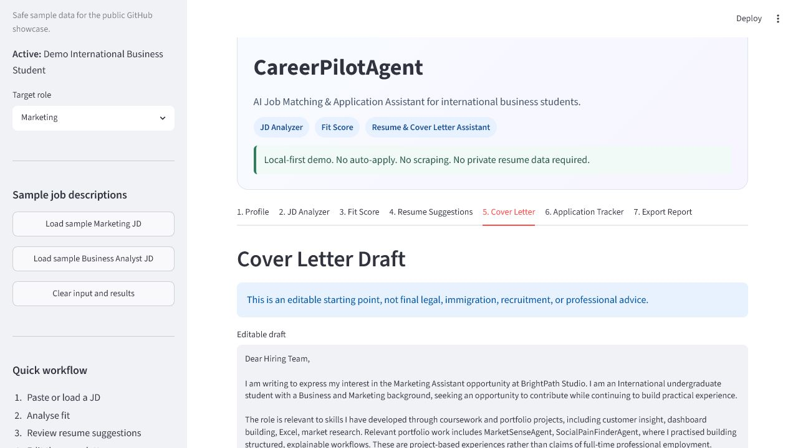
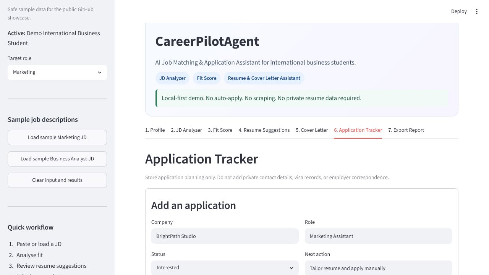
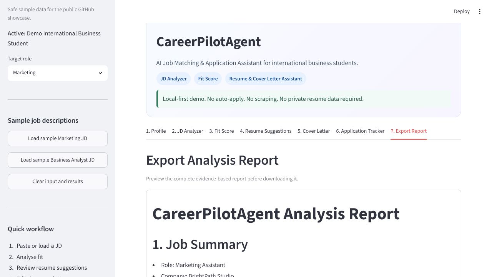

# CareerPilotAgent

**Local-first AI job matching and application assistant for international business students.**

CareerPilotAgent helps users analyse job descriptions, score candidate–role fit, generate realistic resume suggestions, draft editable cover letters, manage an application tracker, and export structured reports. It is designed as a privacy-first portfolio project and does not scrape job boards, auto-apply, or store private resume data in the public repository.

**Current checkpoint: CAREER-005-GITHUB-PUBLIC-SHOWCASE**

## Feature Overview

- **Job Description Analyzer** — extracts role, company, category, seniority, responsibilities, skills, and keywords
- **Explainable Fit Score** — presents seven transparent dimensions, matched skills, gaps, and risk notes
- **Resume Keyword Suggestions** — separates supported keywords from skills that still need evidence
- **Project-Based Resume Bullets** — generates realistic, copy-friendly portfolio statements without inventing employment
- **Editable Cover Letter Draft** — creates a conservative draft with placeholders and TXT export
- **Application Tracker** — stores manual planning data in a local CSV with required-field validation
- **Markdown / TXT / CSV Export** — produces portable reports and tracker files
- **Demo and Local Private Profile Modes** — keeps public-safe demo data separate from optional local profile data
- **Local-First Privacy Design** — requires no account, API key, or external AI service

## Why This Project Exists

CareerPilotAgent demonstrates how an AI-style workflow can solve a practical career problem while keeping decisions explainable and user-controlled. The project combines workflow design, product thinking, Business and Marketing context, privacy-aware automation, local data handling, structured report generation, and a portfolio-ready Streamlit dashboard.

## Who It Is For

- International students
- Business and Marketing students
- Junior job seekers and career switchers
- AI automation learners
- Recruiters, classmates, potential clients, and portfolio reviewers

## Demo Workflow

1. Select Demo Profile or Local Private Profile.
2. Paste a job description or load a synthetic sample.
3. Analyse the job description.
4. Review the fit score, evidence, and gaps.
5. Review keywords, project bullets, and portfolio suggestions.
6. Edit and verify the cover-letter draft.
7. Save a manual tracker entry.
8. Export the Markdown analysis report.

## Screenshots

All screenshots use Demo Profile and synthetic sample data.

### Home and Demo Profile




### Analysis Workflow













See [`docs/SCREENSHOTS_GUIDE.md`](docs/SCREENSHOTS_GUIDE.md) for capture and privacy rules.

## Safety Boundary

This project does not:

- Scrape LinkedIn, SEEK, Indeed, or other job boards
- Auto-apply to jobs
- Send emails
- Store real private resume data in the public repository
- Require API keys
- Call external AI APIs in the current MVP

It is an explainable planning assistant, not a hiring predictor, legal adviser, immigration adviser, or automated applicant.

## Tech Stack

- Python 3.11+
- Streamlit
- pandas
- pytest
- Local JSON and CSV files

## Project Structure

```text
CareerPilotAgent/
|-- app.py
|-- career_pilot/             # parsing, scoring, advice, profiles, reports
|-- data/                     # public-safe samples; private/ is ignored
|-- docs/                     # scope, safety, QA, release guidance
|-- portfolio/                # reviewed showcase assets and notes
|-- tests/                    # automated regression tests
|-- tools/                    # public safety checks
|-- PUBLIC_SHOWCASE_MANIFEST.md
|-- PROJECT_STATUS.md
`-- requirements.txt
```

## How to Run

```powershell
Set-Location F:\AIProjects\CareerPilotAgent
.\.venv\Scripts\python.exe -m streamlit run app.py
```

Open `http://localhost:8501` if a browser does not open automatically.

## How to Test

```powershell
Set-Location F:\AIProjects\CareerPilotAgent
.\.venv\Scripts\python.exe -m pytest
```

## Public Safety Check

```powershell
Set-Location F:\AIProjects\CareerPilotAgent
.\.venv\Scripts\python.exe tools\public_safety_check.py
```

The checker scans public text files, skips private/generated directories, reports documentation-only review warnings, and returns a non-zero status for publish-blocking findings.

## Public Showcase vs Private Data

- `data/sample_profile.json` contains synthetic, public-safe demo data.
- `data/sample_jobs.csv` contains synthetic job descriptions.
- `data/private/user_profile.json` is optional and local-only.
- `data/private/` is ignored by Git.
- Demo Profile must be used for screenshots and public demonstrations.
- Local private profiles, real resumes, contact information, and application notes must never be published.

Git ignore rules reduce accidental commits but do not make local files a secure credential vault.

## Documentation

- [Public Showcase Manifest](PUBLIC_SHOWCASE_MANIFEST.md)
- [Screenshot Guide](docs/SCREENSHOTS_GUIDE.md)
- [GitHub Release Checklist](docs/GITHUB_RELEASE_CHECKLIST.md)
- [Portfolio Positioning](docs/PORTFOLIO_POSITIONING.md)
- [Safety and Privacy](docs/SAFETY_AND_PRIVACY.md)
- [Manual QA Checklist](docs/MANUAL_QA_CHECKLIST.md)

## Current Status

CAREER-001 delivered the local MVP, CAREER-002 polished the interface, CAREER-003 added the privacy-first local profile editor, and CAREER-004 prepared the repository structure, documentation, safety tooling, and release checklist for a public GitHub showcase.

## Roadmap

- **CAREER-005:** Screenshot integration and GitHub publish
- **CAREER-006:** Optional OpenAI-enhanced JD analysis
- **CAREER-007:** Interview question generator
- **CAREER-008:** Resume version matching
- **CAREER-009:** Compliant job-board manual import

Any future networked feature must remain optional, explicit, and consistent with the project's user-control and privacy boundaries.

## Disclaimer

CareerPilotAgent provides educational and organisational support. Its score is a transparent heuristic, not a prediction of hiring outcomes. Users must verify job requirements, protect personal data, edit all drafts, and take responsibility for every claim and application.
